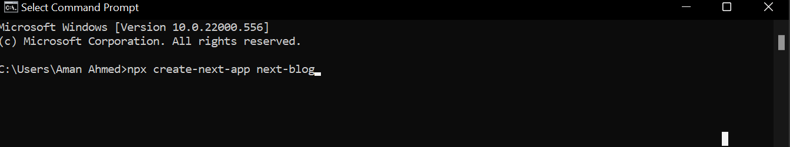
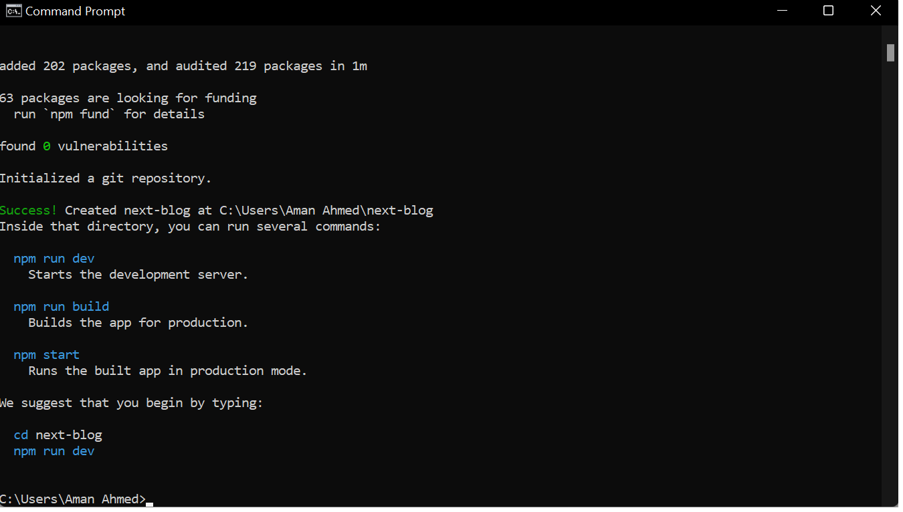
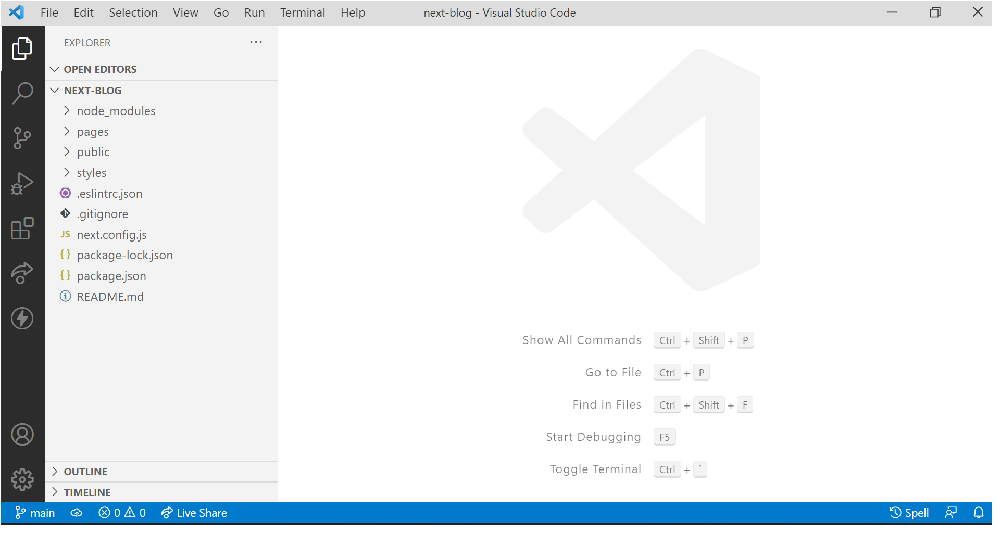
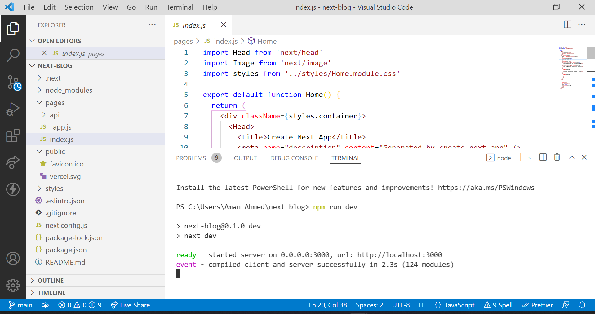
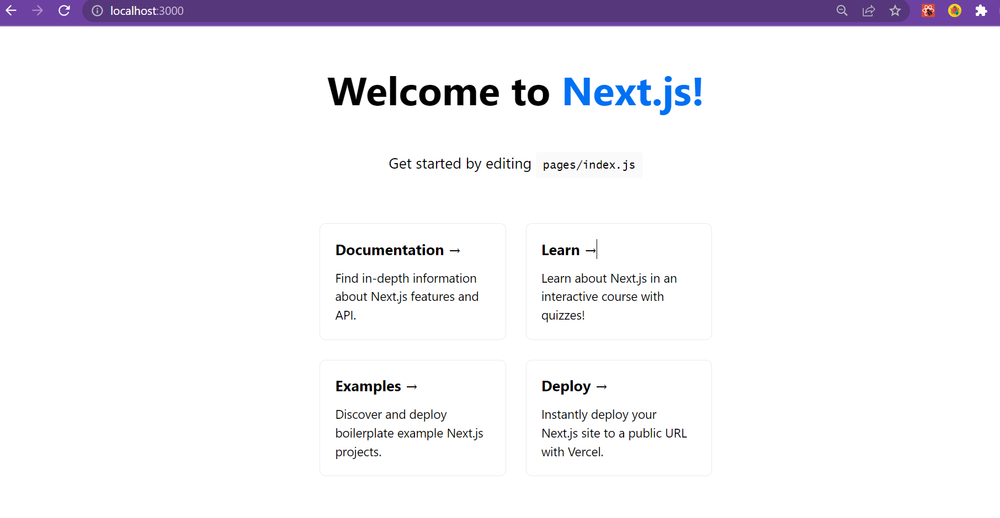
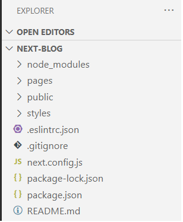
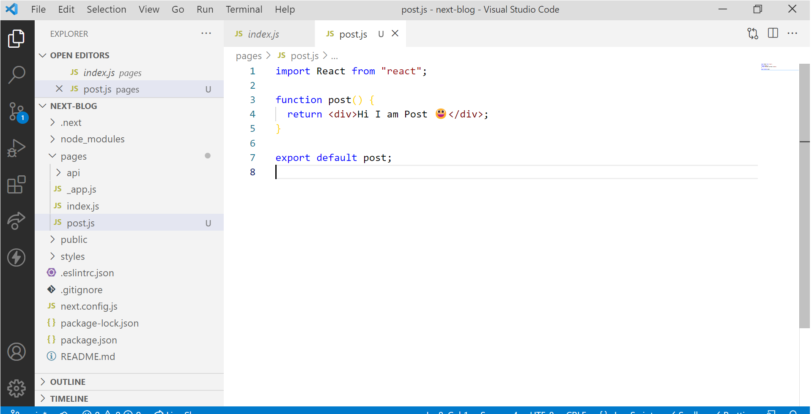
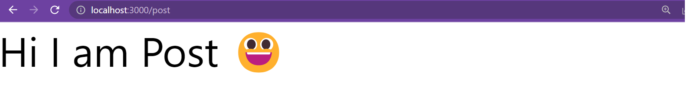

# A Next Blog(Part 1)😃😎

## You need to have😶️

- Knowledge of HTML, CSS, JavaScript

- Familiarity with React (❁´◡`❁)

- A Pinch of Enthusiasm 🥕

## Prerequisites

- Make sure you have node installed. To Check open your command prompt or terminal then run ```node -v``` this should give you your   node version. Make Sure its always greater than 5.2+. Otherwise download from their official website [NodeJS](https://nodejs.org/en). 🌍
- Next you need a Code Editor like vscode , sublime , atom .💻
- You are good to Go .🏎️🏁

## My First Next App

Now There are two ways in which we can choose to create our next app

1. Start Everything from scratch, this would involve setting everything from scratch ie. installing react , react-dom , next etc. 😨

2. The second option is we can create a application by running a simple command on our terminal ```npx create-next-app myapp```. Which would create a prefigured setup for us. Seems Cool right 😃

>So the winner is 2 option 🥇

### Steps

1. Open Your Command Prompt and the run the command ```npx create-next-app myapp``` 

[

>Once you hit enter it is going to take some amount of time generate you Application.

 >Now if you haven't heard of npx before you might  wondering what this ```npx``` is , I don't recall installing this. Is this a 😨, well relax ```npx``` stands for node package execute. This is automatically installed whenever you install node of version 5.2+ . So Chill🥶. 


[


> Now We have successfully🥳created our first Next App. Now lets change directories to our ``` next blog``` so run the command ```cd next-blog```.

 2. Once Inside your ```next-blog``` directory run the ```code .``` . This command will open a vscode instance of you next-blog.

[

## First Run

Open the inbuilt terminal and run the command ```npm run dev``` to start the development server.

[

Your Application is running on ```[localhost:3000](http://localhost:3000/)```.

[

Now this is what the create-next-app gives us a default template.

## Folder Structure 

Now lets Discuss the Folder Structure

[

- **node modules** --> This Folder is going to contain all the pacakages that we will be installing inside of our application. Generally we wouldn't have to bother ourselves with the folder. NextJs takes care of it for us.
- **Pages** --> In Next.js pages are React Component , you create file using extensions like js , jsx , ts , tsx inside the pages directory. By default nextjs provide an index page and a custom app in nextjs. 
  
- Every Page opens with specific router path in web browser.
- Create a file with the name ```post``` and place the data as shown in the picture below .

[

Now let Visit Our Post. Paste this link in your browser ```http://localhost:3000/post```

[

So you see what I am talking about. 

Now we haven't even scratched the surface of what all we can do pages. We will discuss about them in the next tutorial. But Just so you know we can create dynamic route  , nested dynamic routes and a lot more.

-**public** -> Inside this public folder you will find 2 files a favicon and a svg 

-**styles** ->Well the name is self explanatory we will be placing our css inside of this. As You might have already seen what do these files contain and if you are curious about the ```home.module.css`` then just think of this file as a way in which nextjs supports [CSS Modules](https://github.com/css-modules/css-modules).

Well Thats All For this Tutorial 🥇.
See You In the Next One 🧀 .
[EOF]